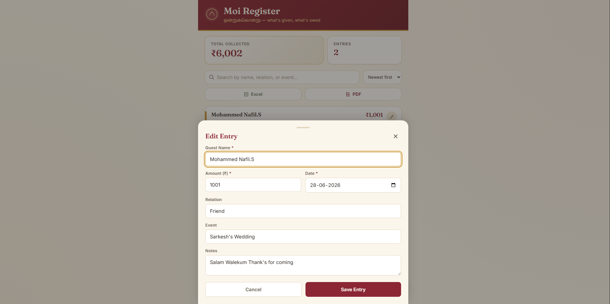

# Moi Register
## screen shot 
(assests/moi-home1.png)

A mobile-friendly web app for digitally tracking "Moi" (cash gifts) given at South Indian weddings and family functions — replacing the paper register.

## Features
- Add, edit, delete, and search guest entries (name, amount, relation, event, date, notes)
- Sort by date, amount, or name
- Running total and entry count shown at the top
- Export the full register to **Excel (.xlsx)** or **PDF**
- Mobile-first responsive design (works great on phones)

## Tech stack
- **Backend:** Flask (Python) + SQLite
- **Frontend:** HTML, CSS, vanilla JavaScript (no build step needed)
- **Exports:** openpyxl (Excel), reportlab (PDF)

## Setup

1. Make sure you have Python 3.8+ installed.

2. Install dependencies:
   ```bash
   pip install flask openpyxl reportlab
   ```

3. Run the app:
   ```bash
   python3 app.py
   ```

4. Open your browser to:
   ```
   http://localhost:5000
   ```

   To access it from your phone on the same Wi-Fi network, find your computer's local IP address (e.g. `192.168.1.5`) and visit `http://192.168.1.5:5000` on your phone.

## Data storage

All entries are stored in a local SQLite database file called `moi_tracker.db`, created automatically in the same folder the first time you run the app. Back this file up (or copy it) if you want to preserve your records.

## Project structure
```
moi-tracker/
├── app.py                 # Flask backend (routes, database, exports)
├── templates/
│   └── index.html         # Main page
└── static/
    ├── style.css          # Styling
    └── app.js             # Frontend logic (CRUD, search, sort, export)
```

## Deploying for everyday use

For day-to-day household use, running it locally on a laptop/PC at home and accessing it from phones over Wi-Fi works fine. If you want access from anywhere (not just home Wi-Fi), you'd want to deploy it to a small cloud host (e.g. Render, Railway, PythonAnywhere) — let me know if you'd like help with that.

Note: the built-in Flask server (`python3 app.py`) is fine for personal/family use but isn't meant for high-traffic public deployment. For that, use a production server like `gunicorn`.
